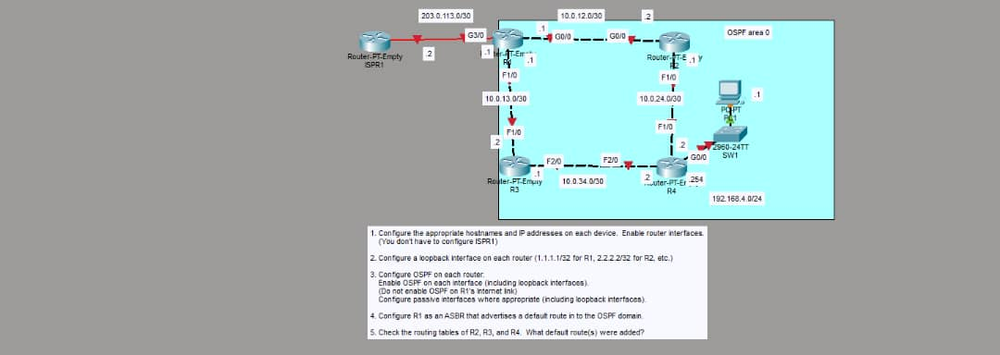
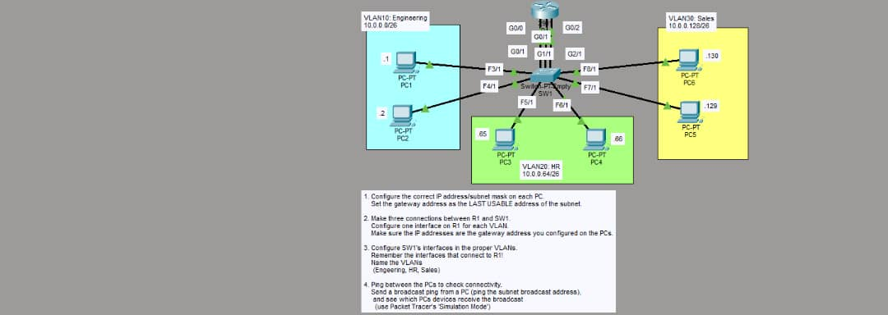

# CCNA-CompTia-Network-plus
# 🌐 Networking Portfolio: CCNA & CompTIA Network+

This repository showcases my networking journey through **CCNA** and **CompTIA Network+**, combining both theoretical knowledge and hands-on practice using Cisco Packet Tracer.

---

## 🎓 Certifications & Learning

- **CCNA (Cisco Certified Network Associate)**  
- **CompTIA Network+**  

These courses helped me understand how networks are designed, secured, and maintained in real-world environments.

---

## 🧪 Hands-On Labs (Packet Tracer)

Below are some of the labs I built using **Cisco Packet Tracer**:

### 🔧 Network Topology Example

### 🌐 Routing & Switching Practice

> These labs demonstrate my understanding of IP addressing, routing, switching, and network configuration.

---

## 🏅 Badges & Achievements

---

## 🧠 Key Skills

- 🌐 Network Fundamentals (OSI Model, TCP/IP)  
- 🔀 Routing & Switching  
- 🛠️ Network Configuration (Packet Tracer)  
- 🔐 Basic Network Security  
- 📡 IP Addressing & Subnetting  

---

## ✨ Significance

- Developed **practical networking skills** using simulations  
- Strengthened my understanding of **real-world network infrastructure**  
- Built a solid foundation for **cybersecurity and advanced networking**
